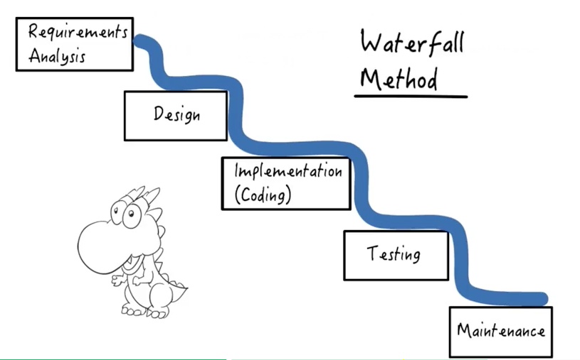
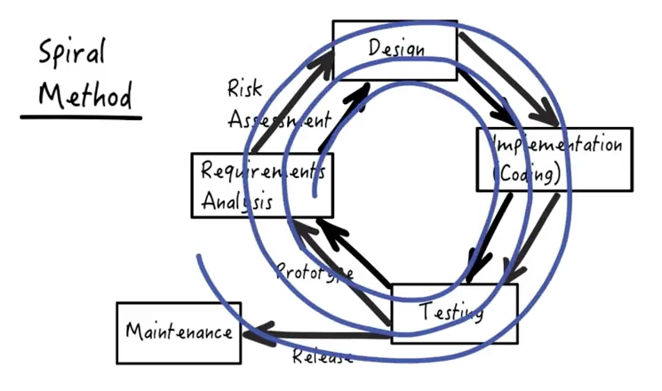

# Software Processes

### Waterfall Method

A linear develoment process:

- Move on to the next development activity when the previous activity is completed in tis entirety.
- Project risk is managed by penalizing backtracking.

### Spiral Process
- Iterative: Rather than going through the software development activities once, you cycle through them many times.
- Incremental: Working software is created a step at a time, and validated at each step.

### Agile Development
- Iterative and incremental process: embracing changing customer requirements.
- Also advocates a more people-centric approach than traditional methods, programmers are more important than the process.
- see [Agile Manifesto](http://agilemanifesto.org)
- Focus on feedback, through regular tests and releases of evolving software - test early and often.
- Emphasis on face-to-face communication over documentation, with main focus on the quality of the software.
- Primary measure of progress: **working software**.
- Agile Principle:
	- By providing a default (i.e., preconfigured) software framework, the development task is greatly simplified - the developer doesn't have to spend a lot of time configuring routine behaviour
	- The developer should only have to specify the unconventional aspects of the application
	- **Dont Repeat Yourself (DRY)**, don't create repetitive information within a system - every piece of information should have a single, unambiguous, authoritative representation within a system. 
	- Develop new functionality -> Refactor(DRY up) code base by finding and removing these repetitive pieces -> develop more new functionality.