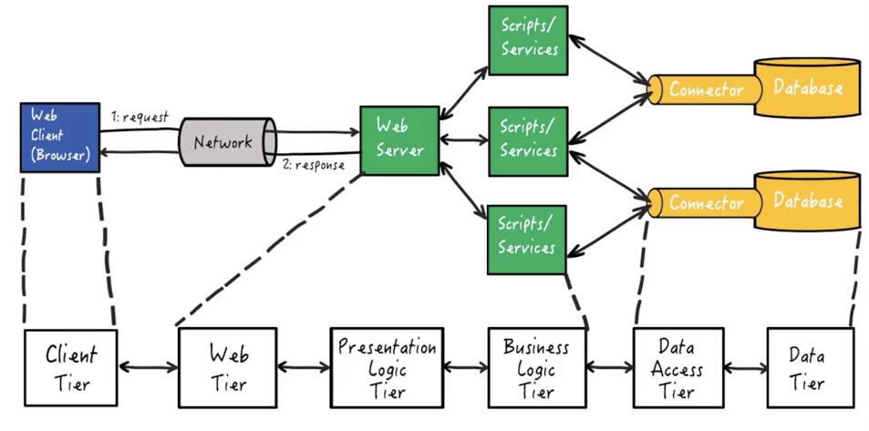

# 3-Tier Architecture

- **Presentation tier**: The user interface
- **Data tier**: Persistent storage of data associated with the application
- **Application (logic) tier**: Retrieves, modifies and/or deletes data in the data tier, and sends the results to the presentation tier. Also responsible for processing the data itself. 

### Web apps are ofthen deloyed as a 3-Tier Architecture

- **Presentation Tier**: User's web browser. 
The Presentation tier is often subdivided into two tiers:

	- **Client Tier**: client-side user interface components
	- **Presentation logic tier**: server-side scripts for generating webpages
	
- **Data Tier**: A relational database. 
Data tier is often subdivided into two tiers:

	- **Data tier**: the data used by the application, a persistent data store of some type
	- **Data Access Tier**: responsible for accessing data from the data tier, and passing it to the business logic tier. 

- **Application (Logic) Tier**: The web server and logic associated with generating dynamic web content.
Application tier is often subdivided into two tiers:
	- **Business logic tier**: Models the business objects associated with the application.
	- **Web Tier**: the web server.

Here is the fully specified client server web based application and how the 6-tier architecture desin pattern overlays:

