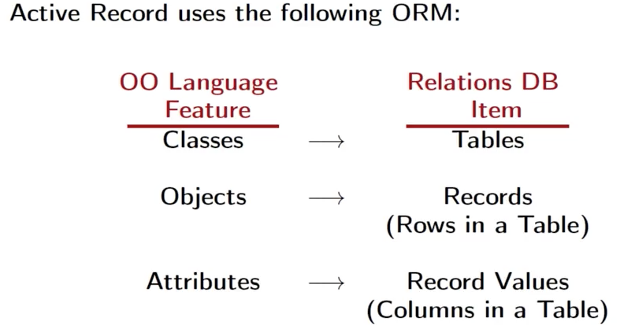

# Active Record Design Pattern

- Commonly used in Ruby as a means of persisting data. It's baked into Rails.
- Used to access data stored in relational databases. Perform CRUD operations without worrying about the specific underlying database technolog: e.g. SQLite, MySQL, SQL Server, Oracle, etc.
- Most applications today use some OO language, and often it is necessary to persist the objects associated with these application. 
- **Big Problem**: The classes and objects associated with an OO language are incompatible with the structure of relational databases.
- **Active Record to the Rescue**: The design pattern encapsulates an **object-relational mapping(ORM)**, i.e., a mapping between OO language constructs and relational databases constructs.
- The ORM provided by Active Record automatically converts objects into constructs that can be stored in a database (and converts them back upon retrieval).

