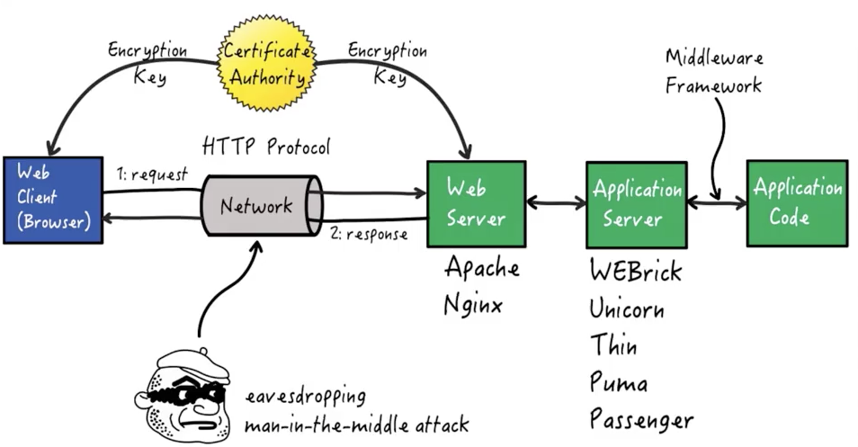

# Middle Frameworks

- Middleware frameworks have been created to connecting web application frameworks to application servers.
- Application developers generally don't modify the services provided by the middleware framework.
- Middleware framework APIs are mainly used by the developers of web app frameworks, and are usually not exposed to the actual users of the web app framework. 

