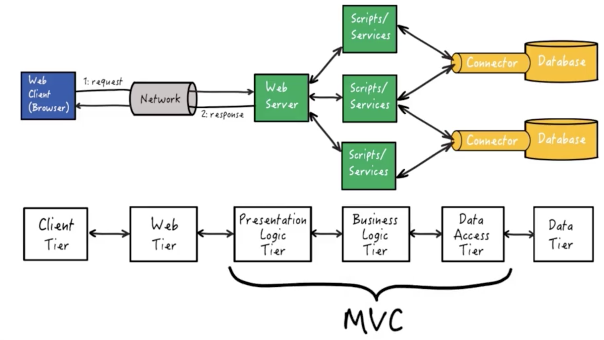

# Model View Controller
The Model-View-Controller (MVC) design pattern provides a means for dealing with complexity:

- Decouples data (model) and presentation (view)
- A Controller handles requests, and coordinates between the model and the view.
- More robust applications, easier to maintain

### MVC Control Flow
1. User interface (view) awaits user input
2. User provides input, e.g. clicks a button
3. Controller handles the input event -> some action(handler or callback) understandable by the model.
4. Controller notifies the model, possibly changing the model's state.
5. Controller notifies the view (if it needs to be updated). Back to step 1. 

### MVC on 6-Tier Architecture
On the 6-tier web application architecture, the model-view-controller design pattern is implemented over the middleware in this architecture:

